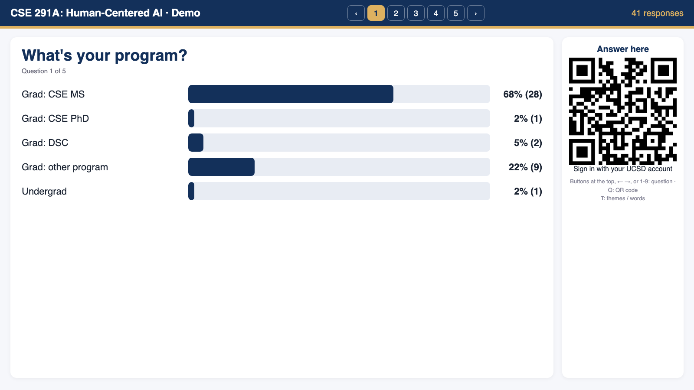
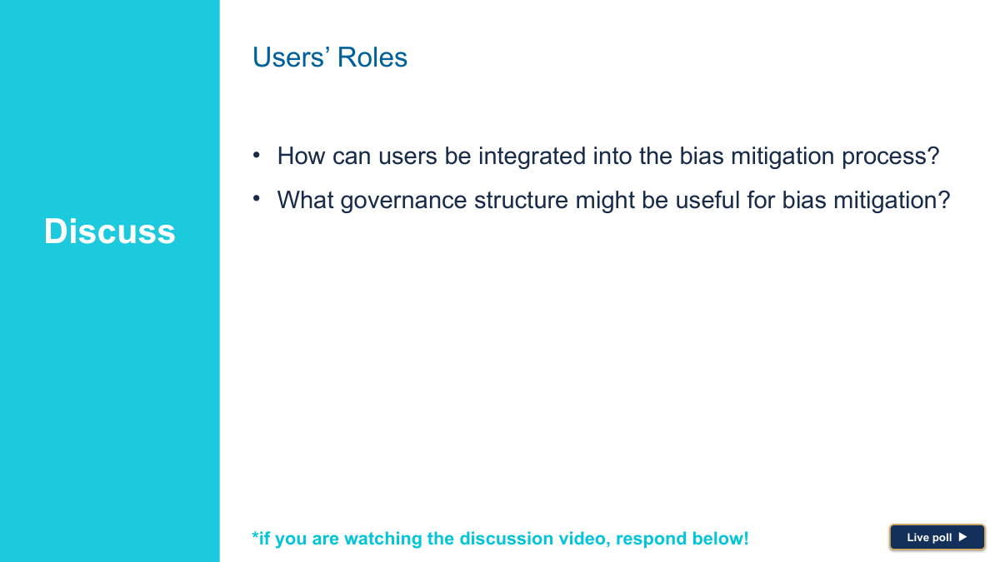
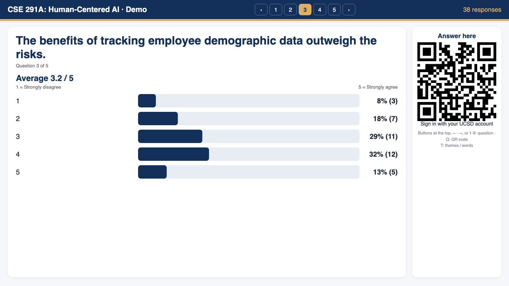
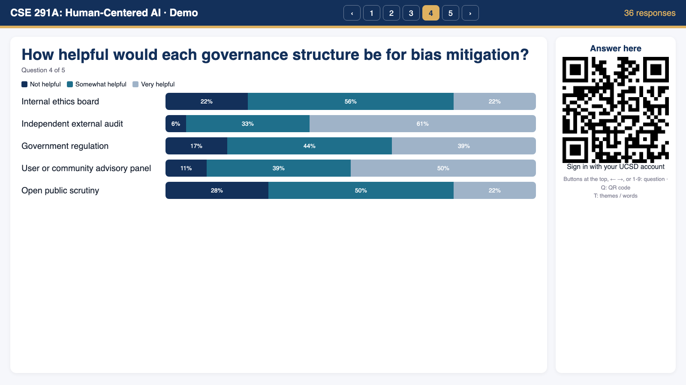
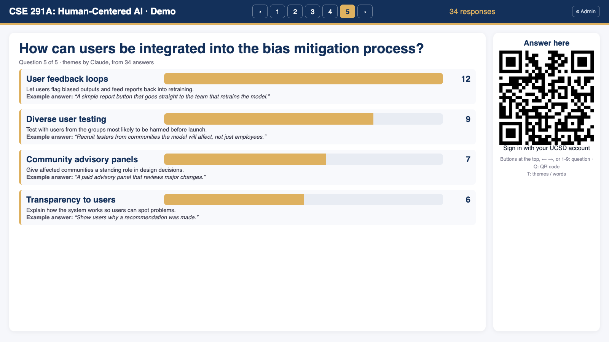

# Google Form Live Poll

Live polls for class discussions, built on Google Forms. Students scan a QR code, sign in with their UCSD account and answer on their phone. The projector shows the results live: bars, word clouds, agreement scales, grids, and themes for open answers grouped by Claude. Every answer is stored with the student's verified UCSD email, so participation credit comes out of a Google Sheet.

- **[Open the admin page](https://script.google.com/a/macros/ucsd.edu/s/AKfycbwQ_D73yvzjz_Gg3jpo7DlhbH8wI4HGrCRUN6s7Bs1btouSh-GG8cDjeluvSUYun_3x/exec?admin)** (questions, answers, board links, new courses; UCSD sign-in, admins only)
- Start page: https://weibellab.github.io/google-form-live-poll/
- Demo with sample data: https://weibellab.github.io/google-form-live-poll/?course=cse291a&demo=1
- Used in: CSE 291A Human-Centered AI, Fall 2026 (Nadir Weibel, TA Weichen Liu)



## Contents

1. [How it works](#how-it-works)
2. [Admin page](#admin-page)
3. [Where the data lives: the course folder](#where-the-data-lives-the-course-folder)
4. [Class instances](#class-instances)
5. [For TAs: running a class](#for-tas-running-a-class)
6. [For TAs: preparing the questions](#for-tas-preparing-the-questions)
7. [Question types and what the board shows](#question-types-and-what-the-board-shows)
8. [Removing answers](#removing-answers-tests-duplicates-inappropriate-text)
9. [Participation credit](#participation-credit)
10. [Setting up a new course](#setting-up-a-new-course)
11. [Privacy](#privacy)
12. [Troubleshooting](#troubleshooting)
13. [Repository layout](#repository-layout)

## How it works

```
 Student phone                Google (instructor's account)                     Projector
 ─────────────                ──────────────────────────────                    ─────────
 QR code ──> Google Form ──> responses (email + answer) ──> Apps Script ──┬──> Firebase ──> Board on GitHub Pages
             (UCSD sign-in)        │                        (on submit)   │    (counts only)  (updates in ~2 s)
                                   │                                      └──> web endpoint (counts only, fallback)
                                   └──> Participation credit Sheet (emails, private)
```

- **One Google Form per question.** Forms live in a Drive folder per week.
- **Apps Script** (project "Google Form Live Poll", owned by the instructor) runs on each submission, counts the answers and writes the counts to **Firebase**. It also serves the same counts from a web endpoint, which the board uses as a fallback, and computes Claude themes for open answers.
- **The board** is a static page on GitHub Pages. It reads only counts, never emails. It needs the board key, which is part of the link.
- **Credit** is written by the same script to a private Google Sheet.

Measured on 2026-10-05: an answer appears on the board about 2 s after the student taps Submit.

## Admin page

Everything a TA or instructor does happens on one private page:

https://script.google.com/a/macros/ucsd.edu/s/AKfycbwQ_D73yvzjz_Gg3jpo7DlhbH8wI4HGrCRUN6s7Bs1btouSh-GG8cDjeluvSUYun_3x/exec?admin

| Tab | What it does |
|---|---|
| Questions | Edit each week's questions, type and choices, or add a question (creates a new styled form). |
| Answers | List a week's answers (email, time, text), delete selected ones from the form and its Sheet, refresh the credit Sheet. |
| Board links | The board link for every week of the course. |
| New course | Set up a new class instance: folders, style master, forms, live updates. |
| Admins | Who can use this page. |

**Access.** You must be signed in with a UC San Diego Google account, and be the script owner or listed on the **Admins** tab. Anyone else sees "no access". The page runs with the owner's permissions, so admins don't need to authorize anything or have access to the Apps Script project.

**Code access.** The code is on GitHub (WeibelLab/google-form-live-poll). Changes to the board (`docs/`) go live through GitHub Pages within a minute. The backend (`apps-script/`) runs in the owner's Apps Script project and is updated there by the owner.

## Where the data lives: the course folder

Each course lives in **one Google Drive folder that the whole teaching team can open**, ideally a Shared Drive folder (or a regular folder shared with the TAs). The admin page creates everything inside it:

```
<course folder>/
  Week 01 (2026-09-29)/                    <- one folder per week: "Week NN (date of the class)"
    W01 Q1 - What's your program?          <- one Google Form per question
    W01 Q1 - What's your program? (responses)   <- its response Sheet (a copy, see below)
    W01 Q2 - ...
  Week 02 (2026-10-06)/
  ...
  _Style master (do not delete)            <- every new form is a copy of this styled form
  Participation credit                     <- credit Sheet (private to the team)
```

The system finds everything by name:

- A course is registered on the admin page with a short name (for example `cse291a`) and the link of its folder.
- The board link says `course=cse291a&week=2`; the script looks in that course's folder for the subfolder whose name starts with `Week 02`.
- Every form in a week folder becomes a slide, in file-name order (`W02 Q1`, `W02 Q2`, …), including forms added later.

The script owner (the instructor who set up the project) needs edit access to the course folder, because the forms are created and read with their account. Student emails stay in the forms and Sheets in this folder, so share it only with the teaching team.

## Class instances

A class instance (for example "CSE 291A Fall 2026" or "CSE 291A Winter 2027") is one course folder plus a short name used in links. Create one on the admin page, **New course** tab:

1. Create the course folder in a Shared Drive (or share a folder with the team) and give the script owner edit access.
2. Fill in title, short name for links (e.g. `cse291a-wi27`), folder link, first class date, number of weeks and questions per week, email domain.
3. **Create course folders**. Optionally open the style master and change the header image or color (palette icon).
4. **Create the forms**. Then edit the questions on the Questions tab. Board links are on the Board links tab.

Google allows 20 triggers per script; each running course uses up to 6 (current and next week), so one script serves about 3 courses at the same time. Older courses keep working on the board, with updates every 3 seconds instead of 2.

## For TAs: running a class

**Before class (2 minutes)**

1. On the classroom computer, open this week's board: the **Live poll ▶** button in the slides, or the admin page, **Board links** tab.
2. Check that the questions are the right ones and show 0 responses.

**In class**

- The discussion slides have a **Live poll ▶** button on each poll slide. Click it during the slideshow to open the board on that question.

  

- Students scan the QR code on the right and answer. Results update in about 2 seconds.
- Switch questions with the **‹ 1 2 3 ›** buttons at the top, the arrow keys, a presentation clicker, or keys 1-9.
- **Q** hides or shows the QR code. **T** switches an open question between Claude themes and a word cloud.
- Add `&q=2` to a link (before `#k=`) to open it on question 2.

**After class**

- Nothing to do. Credit is in the Participation credit Sheet (see below).

## For TAs: preparing the questions

Use the [admin page](#admin-page):

- **Questions** tab: pick the week, edit the question, type and choices, **Save**. Questions that already have answers are locked; delete the answers first (Answers tab) or add a new question.
- **Add a question** at the bottom of the week: it creates a new styled form with all settings. It shows up on the board within 30 seconds.
- The **Board links** tab has the board link for every week.

Tips for good poll questions:

- One idea per question. A slide with three sub-questions becomes three forms.
- Use multiple choice or a scale for opinions, Short answer for one word, Paragraph for one open question per week.
- Offer "Other" on multiple choice so nobody is forced into a choice.
- Activities ("explore this website", "read this document") don't poll well. Ask about the result instead ("What surprised you…").

Editing directly in Google Forms also works: keep the file name prefix (`W05 Q2 - `) and don't change Settings or Publish.

## Question types and what the board shows

The board picks the display from the question type in Google Forms.

| Type in Google Forms | Board |
|---|---|
| Multiple choice, Dropdown | Bars with % and count, in the form's order. Answers typed into "Other" are counted as one **Other** bar; the text is not shown. |
| Checkboxes | Bars, % of students who picked each option |
| Short answer | Word cloud of whole answers ("Claude Code" stays one item) |
| Paragraph | Claude themes: 3 to 7 groups with a summary and one real answer each. **T** switches to a word cloud. |
| Linear scale | Bars per point, the average, and the end labels |
| Rating (stars) | Same as linear scale, with stars |
| Multiple choice grid | One stacked bar per row |

Not used for live polls: Date, Time, File upload, Checkbox grid.

| Multiple choice | Linear scale |
|---|---|
|  |  |
| **Multiple choice grid** | **Paragraph (Claude themes)** |
|  |  |

## Removing answers (tests, duplicates, inappropriate text)

Admin page, **Answers** tab: pick the week, **Load answers**, tick the rows, **Delete selected**. The answer is removed from the Google Form and from its response Sheet; the board updates within a few seconds. The student can then answer that question again.

Deleting by hand works too, but needs both places: the form (**Responses**, trash icon or **Delete all responses**) and the row in the linked Sheet. The board and the credit export read the form; the Sheet is only a copy, and deleting in one place does not change the other.

## Participation credit

The Sheet **Participation credit** in the course folder has:

- **Summary**: one row per student, number of questions answered each week, weeks participated, total.
- **Week NN**: one row per student, the time of each answer.
- **All responses**: every answer with week, question, email, time and text.

It refreshes every hour, and on demand from the admin page (Answers tab, **Refresh credit Sheet**).

## Setting up a new course

Use the admin page, **New course** tab (see [Class instances](#class-instances)).

Setting up the whole system from scratch for a different instructor (own copy):

1. Create an Apps Script project and add the files in `apps-script/`. Run `createBoardKey` and copy `BOARD_KEY` from Project Settings, Script properties. Optional: script property `ANTHROPIC_API_KEY` for Claude themes.
2. Create a style master form (any Google Form, styled with the palette icon) and put its ID in `DEFAULT_MASTER_ID` in `Setup.gs`.
3. Firebase: create a project and a Realtime Database (locked mode), set the rules from `firebase/database.rules.json`, put the URL in `Push.gs` and `docs/config.js`.
4. Deploy twice: **Web app, execute as Me, access Anyone** (the board's data endpoint; URL goes in `docs/config.js` as `api`), and **Web app, execute as Me, access Anyone within your university** (the admin page, open it with `?admin`).
5. Run `syncTriggers` once and `installCreditTrigger` once. Add your courses on the admin page.

After a code change: save, then Deploy, Manage deployments, edit each deployment, New version, Deploy. The URLs stay the same.

## Privacy

- Student emails stay in the instructor's Google Forms and Sheets (UC P3 data, FERPA). They are never in this repository, in Firebase, in the web endpoint or on the board.
- The board shows counts, words, themes and one example answer per theme. Answers are visible on the projector anyway.
- Firebase and the web endpoint only answer with the board key. The key is in the link after `#`, which browsers don't send to GitHub.
- Claude themes send answer text only (no names, no emails) to the Claude API from Apps Script.
- Forms are restricted to UC San Diego accounts. Google requires students to tick "Record my email" for verified email collection; that tick is what makes credit reliable.

## Troubleshooting

| Problem | Fix |
|---|---|
| Board says "bad key" | The link is missing part of the key after `#k=`. Copy it again from the admin page, Board links tab. |
| A question doesn't show | Check the form is in the right week folder, its name starts with `WNN QN - `, and its type is in the table above. Wait 30 s. |
| Answers appear after about 3 s instead of 2 s | The form has no submit trigger yet (new form, or week not current). It is added by the 6 am job. |
| Themes don't appear | Fewer than 3 answers, or `ANTHROPIC_API_KEY` missing. Press T for the word cloud. |
| GitHub Pages is down | On a Mac: `python3 -m http.server 8770 --directory docs` in this repo, then use `http://localhost:8770/` instead of the GitHub address in the link. |
| A student can't open the form | They must sign in with their UCSD Google account (not a personal Gmail). |
| "No access" on the admin page | Sign in with your UCSD account and ask the owner to add you on the Admins tab. |
| A question can't be edited | It already has answers. Delete them on the Answers tab, or add a new question. |

## Repository layout

```
docs/                 board (GitHub Pages): index.html, config.js, img/
apps-script/          Apps Script project: Setup.gs (courses, forms), Board.gs (endpoint, themes, credit), Push.gs (Firebase),
                      Admin.gs + admin.html (admin page), appsscript.json
firebase/             database rules
prototype/            first local version (Python, reads the response Sheets), no longer used
assets/               form header image
HANDOFF.md            original requirements
CLAUDE.md             decisions and current state
```
